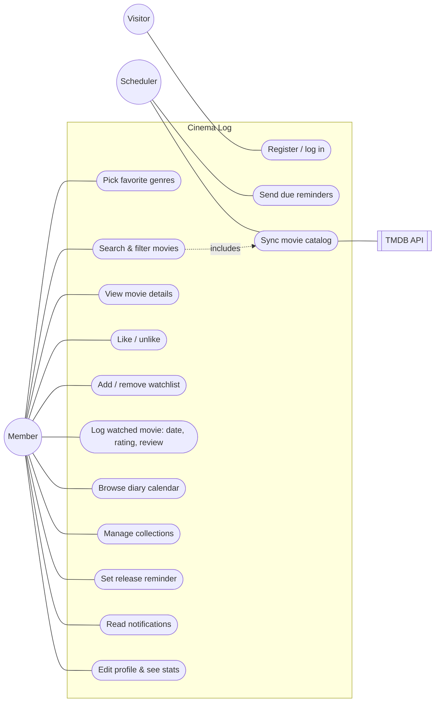

# Use case diagram + descriptions

| ID | Use case | Actor | Main flow | Alternative / error flow |
|---|---|---|---|---|
| UC1 | Register / log in | Visitor | Enter name, email, password → account created → logged in → onboarding | Email taken → 409 "account already exists"; wrong password → login page with error |
| UC2 | Pick favorite genres | Member | Tick genres → save → "your movie personality is ready!" | No genre ticked → "Pick at least one genre" |
| UC3 | Search & filter | Member | Type title / choose genre, year, rating, language, sort → 40 results per page | No match → empty state; TMDB down → local results only |
| UC4 | View movie | Member | Open poster → details, reviews, similar movies | Unknown id → 404 page |
| UC5 | Like | Member | Tap ♡ → heart fills | Tap again → unlike |
| UC6 | Watchlist | Member | Tap + → added; remove from watchlist page | Logging the movie removes it automatically |
| UC7 | Log watched | Member | "you watched it!" → date, stars, review, place → saved to diary | Future date or unreleased movie → 400 |
| UC8 | Diary calendar | Member | Month grid with posters → click day → pop-up with ← / → | Empty month → "your movie memories start here." |
| UC9 | Collections | Member | Create, rename, delete; add/remove movies from ⋯ menu | Duplicate name → 409 |
| UC10 | Release reminder | Member | Upcoming movie → Remind me → when (7/3/1/0 days) + channel | Already released → 400; reminder date already passed → sent immediately |
| UC11 | Notifications | Member | Bell shows release radar + latest messages; opening marks them read | — |
| UC12 | Profile | Member | Edit name/email/bio/avatar/genres; see stats & genre chart | Email used by someone else → 409 |
| UC13 | Send due reminders | Scheduler (hourly) | Find SCHEDULED reminders due today → notify by channel → SENT | Mail server missing → in-app record only |
| UC14 | Sync catalog | Scheduler (6-hourly), search | Pull now playing / upcoming / popular / top rated → upsert by tmdb_id | No API key → skipped |
