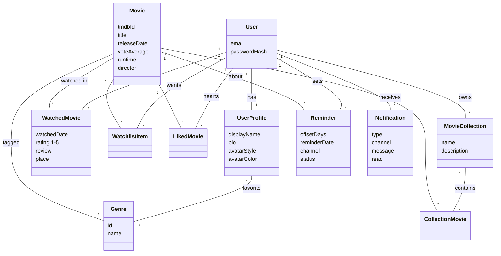

# Domain model (conceptual class diagram)

```mermaid
classDiagram
    User "1" -- "1" UserProfile : has
    UserProfile "*" -- "*" Genre : favorite
    Movie "*" -- "*" Genre : tagged
    User "1" -- "*" WatchedMovie : logs
    Movie "1" -- "*" WatchedMovie : watched in
    User "1" -- "*" WatchlistItem : wants
    Movie "1" -- "*" WatchlistItem
    User "1" -- "*" LikedMovie : hearts
    Movie "1" -- "*" LikedMovie
    User "1" -- "*" MovieCollection : owns
    MovieCollection "1" -- "*" CollectionMovie : contains
    Movie "1" -- "*" CollectionMovie
    User "1" -- "*" Reminder : sets
    Movie "1" -- "*" Reminder : about
    User "1" -- "*" Notification : receives

    class User {
        email
        passwordHash
    }
    class UserProfile {
        displayName
        bio
        avatarStyle
        avatarColor
    }
    class Movie {
        tmdbId
        title
        releaseDate
        voteAverage
        runtime
        director
    }
    class Genre {
        id
        name
    }
    class WatchedMovie {
        watchedDate
        rating 1-5
        review
        place
    }
    class MovieCollection {
        name
        description
    }
    class Reminder {
        offsetDays
        reminderDate
        channel
        status
    }
    class Notification {
        type
        channel
        message
        read
    }
```
