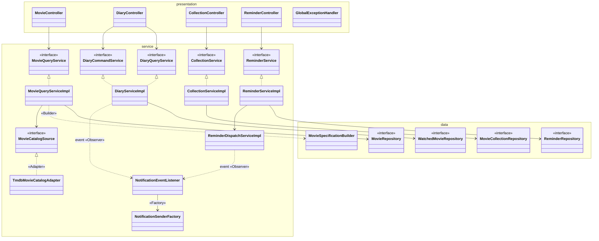

# Class diagram (layers + design pattern positions)

Pattern details are in `../design-patterns.md`. This diagram shows one slice of each module through every layer.

```mermaid
classDiagram
    direction TB
    namespace presentation {
        class MovieController
        class DiaryController
        class CollectionController
        class ReminderController
        class GlobalExceptionHandler
    }
    namespace service {
        class MovieQueryService {
            <<interface>>
        }
        class DiaryQueryService {
            <<interface>>
        }
        class DiaryCommandService {
            <<interface>>
        }
        class CollectionService {
            <<interface>>
        }
        class ReminderService {
            <<interface>>
        }
        class MovieQueryServiceImpl
        class DiaryServiceImpl
        class CollectionServiceImpl
        class ReminderServiceImpl
        class ReminderDispatchServiceImpl
        class MovieCatalogSource {
            <<interface>>
        }
        class TmdbMovieCatalogAdapter
        class NotificationSenderFactory
        class NotificationEventListener
    }
    namespace data {
        class MovieRepository {
            <<interface>>
        }
        class WatchedMovieRepository {
            <<interface>>
        }
        class MovieCollectionRepository {
            <<interface>>
        }
        class ReminderRepository {
            <<interface>>
        }
        class MovieSpecificationBuilder
    }
    MovieController --> MovieQueryService
    DiaryController --> DiaryQueryService
    DiaryController --> DiaryCommandService
    CollectionController --> CollectionService
    ReminderController --> ReminderService
    MovieQueryService <|.. MovieQueryServiceImpl
    DiaryQueryService <|.. DiaryServiceImpl
    DiaryCommandService <|.. DiaryServiceImpl
    CollectionService <|.. CollectionServiceImpl
    ReminderService <|.. ReminderServiceImpl
    MovieQueryServiceImpl --> MovieRepository
    MovieQueryServiceImpl ..> MovieSpecificationBuilder : «Builder»
    MovieQueryServiceImpl --> MovieCatalogSource
    MovieCatalogSource <|.. TmdbMovieCatalogAdapter : «Adapter»
    DiaryServiceImpl --> WatchedMovieRepository
    DiaryServiceImpl ..> NotificationEventListener : event «Observer»
    CollectionServiceImpl --> MovieCollectionRepository
    ReminderServiceImpl --> ReminderRepository
    ReminderServiceImpl --> ReminderDispatchServiceImpl
    ReminderDispatchServiceImpl ..> NotificationEventListener : event «Observer»
    NotificationEventListener --> NotificationSenderFactory : «Factory»
```
