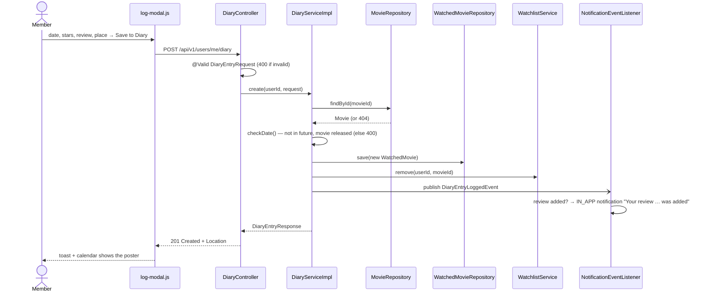
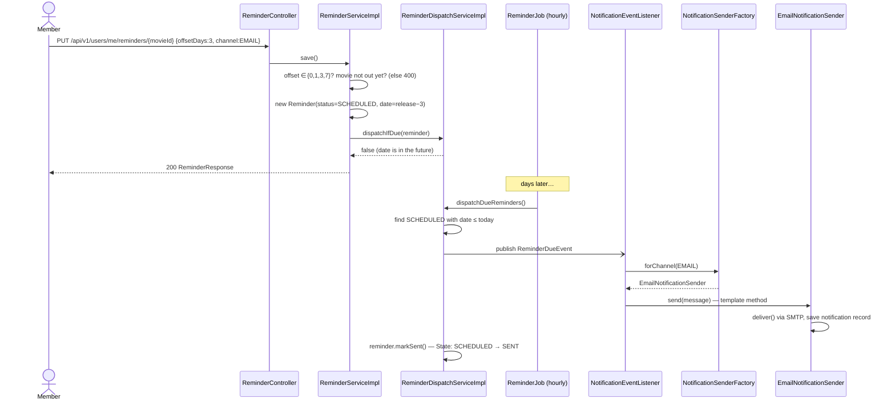
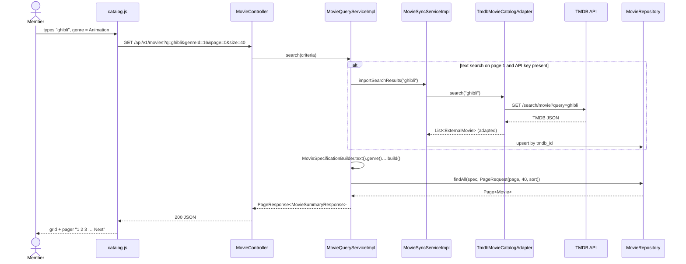

# Sequence diagrams (3 main scenarios)

## 1. Log a watched movie ("you watched it!")

```mermaid
sequenceDiagram
    actor U as Member
    participant JS as log-modal.js
    participant C as DiaryController
    participant S as DiaryServiceImpl
    participant MR as MovieRepository
    participant WR as WatchedMovieRepository
    participant WL as WatchlistService
    participant L as NotificationEventListener
    U->>JS: date, stars, review, place → Save to Diary
    JS->>C: POST /api/v1/users/me/diary
    C->>C: @Valid DiaryEntryRequest (400 if invalid)
    C->>S: create(userId, request)
    S->>MR: findById(movieId)
    MR-->>S: Movie (or 404)
    S->>S: checkDate() — not in future, movie released (else 400)
    S->>WR: save(new WatchedMovie)
    S->>WL: remove(userId, movieId)
    S-)L: publish DiaryEntryLoggedEvent
    L->>L: review added? → IN_APP notification "Your review … was added"
    S-->>C: DiaryEntryResponse
    C-->>JS: 201 Created + Location
    JS-->>U: toast + calendar shows the poster
```

## 2. Set a release reminder and receive it

```mermaid
sequenceDiagram
    actor U as Member
    participant C as ReminderController
    participant S as ReminderServiceImpl
    participant D as ReminderDispatchServiceImpl
    participant Job as ReminderJob (hourly)
    participant L as NotificationEventListener
    participant F as NotificationSenderFactory
    participant E as EmailNotificationSender
    U->>C: PUT /api/v1/users/me/reminders/{movieId} {offsetDays:3, channel:EMAIL}
    C->>S: save()
    S->>S: offset ∈ {0,1,3,7}? movie not out yet? (else 400)
    S->>S: new Reminder(status=SCHEDULED, date=release−3)
    S->>D: dispatchIfDue(reminder)
    D-->>S: false (date is in the future)
    S-->>U: 200 ReminderResponse
    Note over Job: days later…
    Job->>D: dispatchDueReminders()
    D->>D: find SCHEDULED with date ≤ today
    D-)L: publish ReminderDueEvent
    L->>F: forChannel(EMAIL)
    F-->>L: EmailNotificationSender
    L->>E: send(message) — template method
    E->>E: deliver() via SMTP, save notification record
    D->>D: reminder.markSent() — State: SCHEDULED → SENT
```

## 3. Search the catalog (with TMDB import)

```mermaid
sequenceDiagram
    actor U as Member
    participant JS as catalog.js
    participant C as MovieController
    participant Q as MovieQueryServiceImpl
    participant Y as MovieSyncServiceImpl
    participant A as TmdbMovieCatalogAdapter
    participant T as TMDB API
    participant R as MovieRepository
    U->>JS: types "ghibli", genre = Animation
    JS->>C: GET /api/v1/movies?q=ghibli&genreId=16&page=0&size=40
    C->>Q: search(criteria)
    alt text search on page 1 and API key present
        Q->>Y: importSearchResults("ghibli")
        Y->>A: search("ghibli")
        A->>T: GET /search/movie?query=ghibli
        T-->>A: TMDB JSON
        A-->>Y: List<ExternalMovie> (adapted)
        Y->>R: upsert by tmdb_id
    end
    Q->>Q: MovieSpecificationBuilder.text().genre()….build()
    Q->>R: findAll(spec, PageRequest(page, 40, sort))
    R-->>Q: Page<Movie>
    Q-->>C: PageResponse<MovieSummaryResponse>
    C-->>JS: 200 JSON
    JS-->>U: grid + pager "1 2 3 … Next"
```
