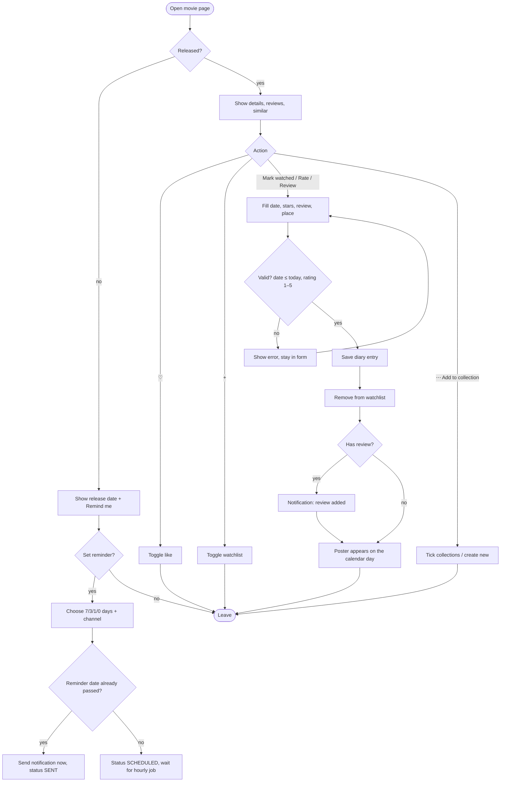

# Activity diagram — from opening a movie to a diary entry

```mermaid
flowchart TD
    A([Open movie page]) --> B{Released?}
    B -- no --> C[Show release date + Remind me]
    C --> D{Set reminder?}
    D -- yes --> E[Choose 7/3/1/0 days + channel] --> F{Reminder date already passed?}
    F -- yes --> G[Send notification now, status SENT]
    F -- no --> H[Status SCHEDULED, wait for hourly job]
    D -- no --> Z([Leave])
    B -- yes --> I[Show details, reviews, similar]
    I --> J{Action}
    J -- ♡ --> K[Toggle like]
    J -- + --> L[Toggle watchlist]
    J -- Mark watched / Rate / Review --> M[Fill date, stars, review, place]
    M --> N{Valid? date ≤ today, rating 1–5}
    N -- no --> O[Show error, stay in form] --> M
    N -- yes --> P[Save diary entry]
    P --> Q[Remove from watchlist]
    Q --> R{Has review?}
    R -- yes --> S[Notification: review added]
    R -- no --> T
    S --> T[Poster appears on the calendar day]
    J -- ⋯ Add to collection --> U[Tick collections / create new]
    K & L & T & U --> Z
```
