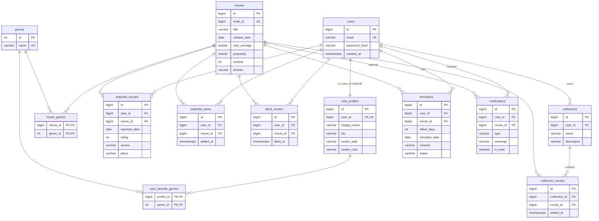

# ER diagram

Relationship checklist: **One-to-One** users–user_profiles · **One-to-Many** users→watched_movies, users→collections→collection_movies, users→reminders · **Many-to-Many** (bonus) movies–genres, user_profiles–genres, collections–movies (with `added_at`).
