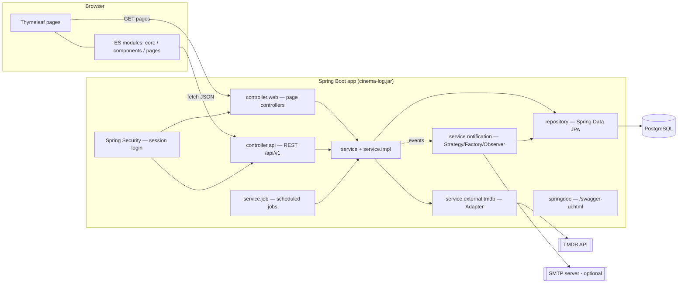
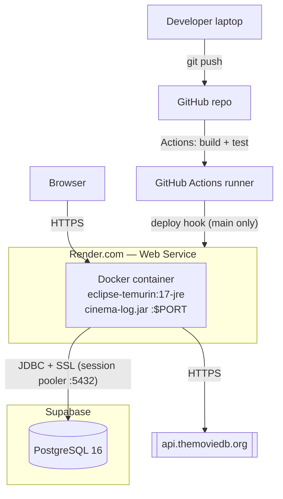

# Component diagram & deployment diagram

## Components

```mermaid
flowchart LR
    subgraph Browser
      V[Thymeleaf pages] --- JS[ES modules: core / components / pages]
    end
    subgraph "Spring Boot app (cinema-log.jar)"
      WEB[controller.web — page controllers]
      API[controller.api — REST /api/v1]
      SEC[Spring Security — session login]
      SVC[service + service.impl]
      NOTI[service.notification — Strategy/Factory/Observer]
      TMDB[service.external.tmdb — Adapter]
      REPO[repository — Spring Data JPA]
      JOB[service.job — scheduled jobs]
      DOC[springdoc — /swagger-ui.html]
    end
    DB[(PostgreSQL)]
    EXT[[TMDB API]]
    SMTP[[SMTP server - optional]]
    JS -- fetch JSON --> API
    V -- GET pages --> WEB
    SEC --> WEB & API
    WEB & API --> SVC
    SVC --> REPO --> DB
    SVC --> TMDB --> EXT
    JOB --> SVC
    SVC -. events .-> NOTI --> REPO
    NOTI --> SMTP
```

## Deployment

```mermaid
flowchart TB
    dev[Developer laptop] -- git push --> gh[GitHub repo]
    gh -- Actions: build + test --> ci[GitHub Actions runner]
    ci -- deploy hook (main only) --> render
    subgraph render [Render.com — Web Service]
      ctr[Docker container<br/>eclipse-temurin:17-jre<br/>cinema-log.jar :$PORT]
    end
    subgraph supa [Supabase]
      pg[(PostgreSQL 16)]
    end
    user[Browser] -- HTTPS --> ctr
    ctr -- JDBC + SSL (session pooler :5432) --> pg
    ctr -- HTTPS --> tmdb[[api.themoviedb.org]]
```
