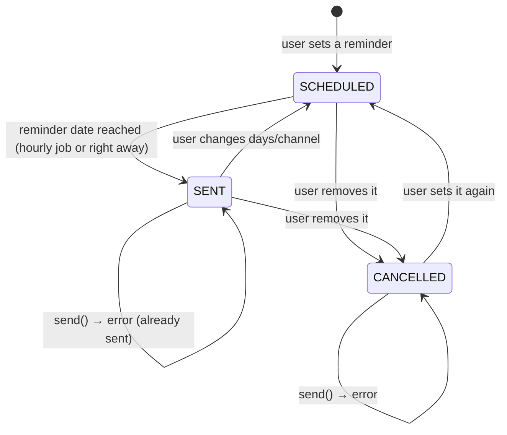

# State diagram — Reminder

Implemented by `ReminderStatus` (State pattern).

```mermaid
stateDiagram-v2
    [*] --> SCHEDULED : user sets a reminder
    SCHEDULED --> SENT : reminder date reached (hourly job or right away)
    SCHEDULED --> CANCELLED : user removes it
    SENT --> CANCELLED : user removes it
    SENT --> SCHEDULED : user changes days/channel
    CANCELLED --> SCHEDULED : user sets it again
    SENT --> SENT : send() → error (already sent)
    CANCELLED --> CANCELLED : send() → error
```
